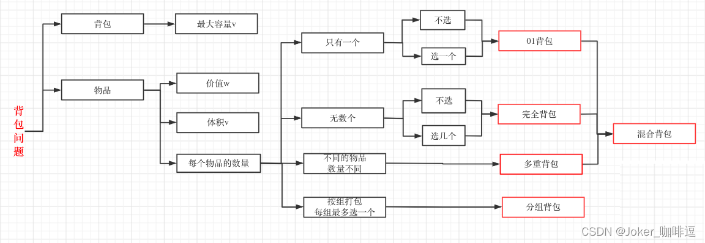

# 一、 背包问题

[原网址:【动态规划】背包问题（详细总结，很全）](https://blog.csdn.net/m0_51370744/article/details/127120649)

## 1. 背包问题总结

暴力的解法是指数级别的时间复杂度。进而才需要动态规划的解法来进行优化！
背包问题是动态规划（Dynamic Planning） 里的非常重要的一部分,关于几种常见的背包，其关系如下：



在解决背包问题的时候，我们通常都是按照如下五部来逐步分析，把这五部都搞透了，算是对动规来理解深入了。

### 1）动规四部曲：

- （1） 确定 dp 数组及其下标的含义
- （2） 确定递推公式
- （3） dp 数组的初始化
- （4） 确定遍历顺序

### 2） 递推公式总结：

- 1. 问能否能装满背包（或者最多装多少）：

```js
dp[j] = max(dp[j], dp[j - nums[i]] + nums[i])
```

- 2. 问装满背包有几种方法：

```js
dp[j] += dp[j - nums[i]]
```

- 3. 问背包装满最大价值：

```js
dp[j] = max(dp[j], dp[j - weight[i]] + value[i])
```

- 4. 问装满背包所需物品的最小个数（物品数量无限，完全背包）：

```js
dp[j] = min(dp[j], dp[j - coins[i]] + 1)
```

### 3） 遍历顺序总结：

- 二维 dp 数组 01 背包，先遍历物品还是先遍历背包都是可以的，且第二层 for 循环是从小到大遍历
- 一维 dp 数组 01 背包，只能先遍历物品再遍历背包容量，且第二层 for 循环是从大到小遍历。
- 求组合数：外层遍历物品，内层遍历背包
- 求排列数：外层遍历背包，内层遍历物品
- 求最小数：两层 for 循环的先后顺序无所谓

## 2. 01 背包

> 有 n 件物品和一个最多能背重量为 w 的背包。第 i 件物品的重量是 weight[i]，得到的价值是 value[i]
> 。每件物品只能用一次，求解将哪些物品装入背包里物品价值总和最大。

### 1） 二维 dp 数组

对于背包问题，有一种写法是使用二维数组。

**动规四部曲：**

- 1） 确定 dp 数组及其下标的含义

  dp[i][j] 表示从下标为 [0 - i] 的物品里任意取，放进容量为 j 的背包，价值总和最大是多少。

- 2） 确定递推公式

  - 不放物品 i：由 `dp[i - 1][j]` 推出，即背包容量为 `j`，里面不放物品 i 的最大价值，此时 `dp[i][j]` 就是 `dp[i - 1][j]`。(其实就是当物品 i 的重量大于背包 j 的重量时，物品 i 无法放进背包中，所以被背包内的价值依然和前面相 同。)

  - 放物品 i：由 `dp[i - 1][j - weight[i]]` 推出，`dp[i - 1][j - weight[i]]` 为背包容量为 `j - weight[i]` 的时候不放物品 `i` 的最大价值，那么 `dp[i - 1]j - weight[i]] + value[i]` （物品 i 的价值），就是背包放物品 i 得到的最大价值

  - 所以递归公式：

  ```js
  dp[i][j] = max(dp[i - 1][j], dp[i - 1][j - weight[i]] + value[i])
  ```

- 3）dp 数组的初始化

  - 首先从 `dp[i][j]` 的定义出发，如果背包容量 j 为 0 的话，即 `dp[i][0]` ，无论是选取哪些物品，背包价值总和一定为 0
  - 状态转移方程 `dp[i][j] = max(dp[i - 1][j], dp[i - 1]j - weight[i]] + value[i]);` 可以看出 i 是由 i-1 推导出来，那么 i 为 0 的时候就一定要初始化。
  - dp[0][j]：存放编号 0 的物品的时候，各个容量的背包所能存放的最大重量 j。
    那么很明显当 `j < weight[0]` 时，dp[0][j] 应该是 0（背包容量比编号 0 的物品重量还小）
    同理，当 `j >= weight[0]` 时，dp[0][j] 应该是 value[0]（背包容量足够放编号 0 物品)

- 4） 确定遍历顺序

  遍历顺序总结：

  - 二维 dp 数组 01 背包，先遍历物品还是先遍历背包都是可以的，且第二层 for 循环是从小到大遍历
  - 一维 dp 数组 01 背包，只能先遍历物品再遍历背包容量，且第二层 for 循环是从大到小遍历

**代码实现**

python(二维 dp 数组）

```py
bag_size = 4
weight = [1, 3, 4]
value = [15, 20, 30]

rows, cols = len(weight), bag_size + 1
dp = [[0]*cols for _ in range(rows)]

# 初始化dp数组.
for i in range(rows):
    dp[i][0] = 0
first_item_weight, first_item_value = weight[0], value[0]
for j in range(1, cols):
    if first_item_weight <= j:
        dp[0][j] = first_item_value

# 更新dp数组: 先遍历物品, 再遍历背包.
for i in range(1, rows):
    for j in range(1, cols):
        if weight[i] > j:  # 说明背包装不下当前物品.
            dp[i][j] = dp[i - 1][j]  # 所以不装当前物品.
        else:
            # 定义dp数组: dp[i][j] 前i个物品里，放进容量为j的背包，价值总和最大是多少。
            dp[i][j] = max(dp[i - 1][j], dp[i - 1][j - weight[i]] + value[i])
print(dp)
```

### 2） 一维 dp 数组

在使用二维数组的时候，递推公式：`dp[i][j] = max(dp[i - 1][j], dp[i - 1]j - weight[i]] + value[i])`
其实可以发现如果把 `dp[i - 1]` 那一层拷贝到 `dp[i]` 上，表达式完全可以是：`dp[i][j] = max(dp[i][j], dp[i]j - weight[i]] + value[i])`
与其把 `dp[i - 1]` 这一层拷贝到 `dp[i]` 上，不如只用一个一维数组了，只用 `dp[j]`（一维数组，也可以理解是一个滚动数组）。

**动规四部曲:**

- 确定 dp 数组及其下标的含义
  在一维 dp 数组中，dp[j]表示：容量为 j 的背包，所背的物品价值可以最大为 dp[j]。
- 确定递推公式
  dp[j]可以通过 `dp[j - weight[i]]` 推导出来，`dp[j - weight[i]]` 表示容量为 `j - weight[i]` 的背包所背的最大价值。
  `dp[j - weight[i]] + value[i]` 表示 `容量为 j - 物品 i 重量的背包` 加上 `物品 i 的价值`。（也就是容量为 j 的背包，放入物品 i 了之后的价值即：dp[j]）
  此时 dp[j]有两个选择：
  - 1）取自己 dp[j] 相当于 二维 dp 数组中的 dp[i-1][j]，即不放物品 i；
  - 2）取 dp[j - weight[i]] + value[i]，即放物品 i，指定是取最大的
  - 所以递推公式：
    `dp[j] = max(dp[j], dp[j - weight[i]] + value[i]);`
- dp 数组的初始化
  dp[j]表示：容量为 j 的背包，所背的物品价值可以最大为 dp[j]。那么 dp[0]就应该是 0，因为背包容量为 0 所背的物品的最大价值就是 0。其他的也初始化为 0，这样在递归的时候，才会被覆盖成较大的值。
- 确定遍历顺序

```js
for(int i = 0; i < weight.size(); i++) { // 遍历物品
    for(int j = bagWeight; j >= weight[i]; j--) { // 遍历背包容量
        dp[j] = max(dp[j], dp[j - weight[i]] + value[i]);

    }
}
```

> 从大大小遍历的原因：倒序遍历是为了保证物品 i 只被放入一次！但如果一旦正序遍历了，那么物品 0 就会被重复加入多次！

**代码实现**

python(一维 dp 数组）

```py
weight = [1, 3, 4]
value = [15, 20, 30]
bag_weight = 4
# 初始化: 全为0
dp = [0] * (bag_weight + 1)

# 先遍历物品, 再遍历背包容量
for i in range(len(weight)):
    for j in range(bag_weight, weight[i] - 1, -1):
        # 递归公式
        dp[j] = max(dp[j], dp[j - weight[i]] + value[i])
print(dp)
```

## 3. 完全背包

> 有 N 件物品和一个最多能背重量为 W 的背包。第 i 件物品的重量是 weight[i]，得到的价值是 value[i]。每件物品都有无限个（也就是可以放入背包多次），求解将哪些物品装入背包里物品价值总和最大。
> 完全背包和 01 背包问题唯一不同的地方就是，每种物品有无限件。

我们知道 01 背包内嵌的循环是从大到小遍历，为了保证每个物品仅被添加一次。
而完全背包的物品是可以添加多次的，所以要从小到大去遍历，即：

- 01 背包

```js
// 01背包  先遍历物品，再遍历背包
for(int i = 0; i < weight.size(); i++) { // 遍历物品
    for(int j = bagWeight; j >= weight[i]; j--) { // 遍历背包容量
        dp[j] = max(dp[j], dp[j - weight[i]] + value[i]);

    }
}
```

- 完全背包

```js
// 1. 先遍历物品，再遍历背包
for(int i = 0; i < weight.size(); i++) { // 遍历物品
    for(int j = weight[i]; j <= bagWeight ; j++) { // 遍历背包容量

        dp[j] = max(dp[j], dp[j - weight[i]] + value[i]);
    }
}
// 2. 先遍历背包，再遍历物品
for(int j = 0; j <= bagWeight; j++) { // 遍历背包容量
    for(int i = 0; i < weight.size(); i++) { // 遍历物品
    	// 容量 > 物品重量， 则更新dp数组
        if (j >= weight[i])  dp[j] = max(dp[j], dp[j - weight[i]] + value[i]);
    }
}
```

**遍历顺序总结：**

- 纯完全背包的一维 dp 数组实现，先遍历物品还是先遍历背包都是可以的，且第二层 for 循环是从小到大遍历。
- 求组合数：外层 for 循环遍历物品，内层 for 遍历背包
- 求排列数：外层 for 遍历背包，内层 for 循环遍历物品
- 求最小数：两层 for 循环的先后顺序无所谓

**代码实现**
python

```py
// 1.先遍历物品，再遍历背包
def test_complete_pack1():
    weight = [1, 3, 4]
    value = [15, 20, 30]
    bag_weight = 4

    dp = [0]*(bag_weight + 1)

    for i in range(len(weight)):
        for j in range(weight[i], bag_weight + 1):
            dp[j] = max(dp[j], dp[j - weight[i]] + value[i])

    print(dp[bag_weight])

// 2. 先遍历背包，再遍历物品
def test_complete_pack2():
    weight = [1, 3, 4]
    value = [15, 20, 30]
    bag_weight = 4

    dp = [0]*(bag_weight + 1)

    for j in range(bag_weight + 1):
        for i in range(len(weight)):
            if j >= weight[i]: dp[j] = max(dp[j], dp[j - weight[i]] + value[i])

    print(dp[bag_weight])


if __name__ == '__main__':
    test_complete_pack1()
    test_complete_pack2()

```

## 总结


